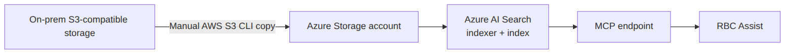
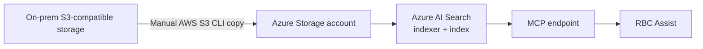
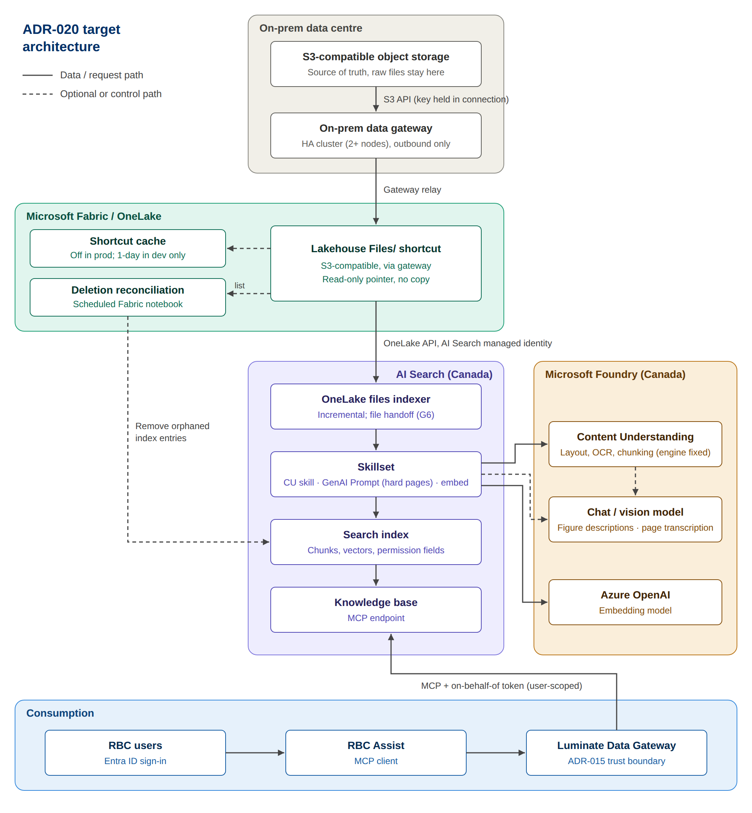
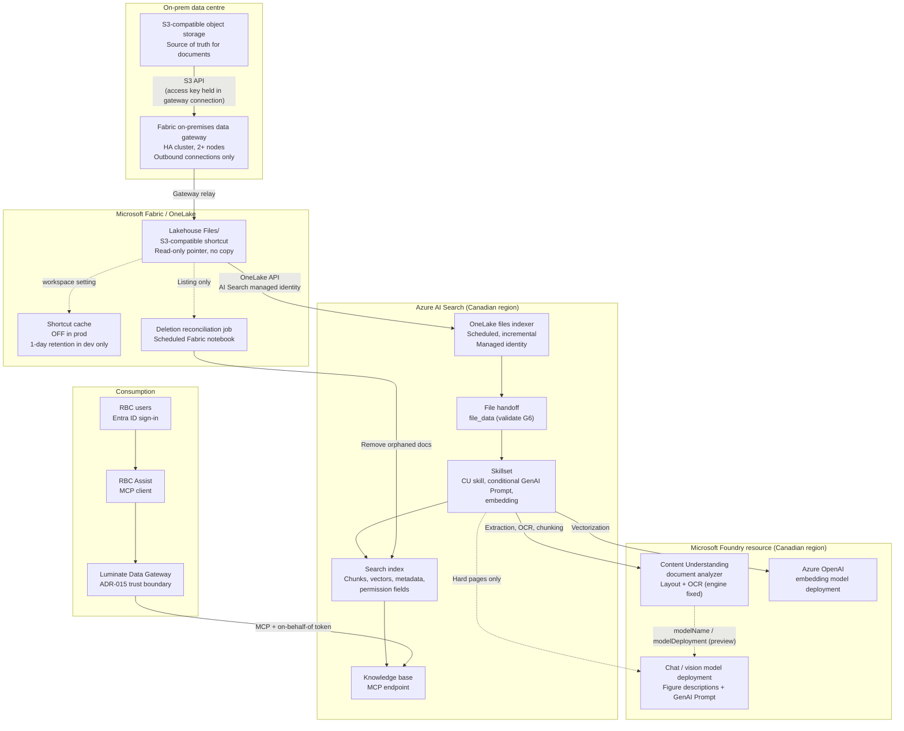
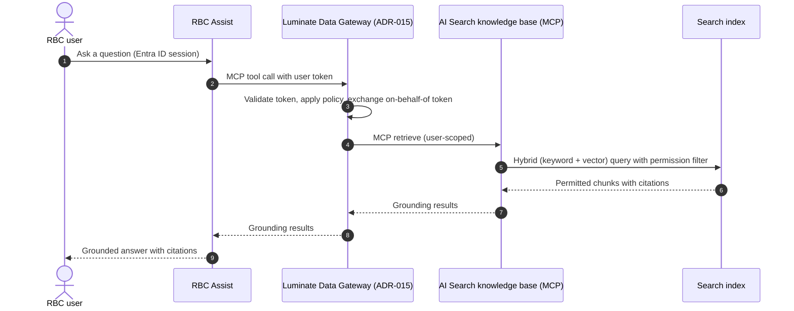

# ADR-020: Ground RBC Assist on on-prem S3 content via OneLake shortcuts and Azure AI Search

| Field | Value |
|---|---|
| **Status** | Proposed, conditional on Microsoft product group validation (see [Decision gate](#6-decision-gate)) |
| **Date** | 2026-09-15 |
| **Decider** | George Chilakos, Senior Director, Enterprise Data Platforms |
| **Consulted** | Solution architect (RAG service), Platform Engineering, Information Security, Data Governance |
| **Related ADRs** | ADR-010/011 (Fabric as BI/AI semantic surface), ADR-015 (Luminate Data Gateway as trust boundary for agentic traffic) |
| **Supersedes** | Current manual AWS CLI copy process for RAG grounding data |
| **Revision** | Rev 2 (2026-09-15): corrected Content Understanding skill details (billing, file input, analyzer selection); added OCR model-configurability analysis and selective vision-model routing |
| **Diagrams** | PNG images in `diagrams/` (editable SVG for the target architecture); Mermaid source under each image |

---

## 1. Context

### 1.1 Current state

RBC Assist, the enterprise conversational chatbot, is grounded on documents indexed by Azure AI Search. Today the pipeline works as follows:

1. Source documents live in **on-prem S3-compatible object storage**.
2. An engineer **manually copies** the documents into an **Azure Storage account** using the **AWS S3 CLI**, because the target endpoint accepts the S3-compatible protocol. The data goes to Azure, not AWS; the AWS CLI is just the copy tool.
3. **Azure AI Search** indexes the storage account, because that is where its indexers read from.
4. Azure AI Search exposes the index through an **MCP endpoint**.
5. **RBC Assist** connects to that MCP endpoint to retrieve grounding content.



<details>
<summary>Mermaid source</summary>



</details>

### 1.2 Problems with the current state

- **Manual and error-prone.** Copies depend on people running CLI jobs, so there is no guaranteed freshness, lineage or audit trail.
- **Duplicate raw data.** A full second copy of the source documents sits in an Azure storage account and must be secured, governed and eventually cleaned up separately.
- **Drift.** Deletions and updates on-prem don't reliably reach the storage account or the index.
- **Out of line with the platform direction.** RBC runs Microsoft Fabric at scale, and OneLake is the strategic namespace. The RAG pipeline currently bypasses it.
- **The data isn't moving.** Most of this content will stay in on-prem S3 storage for the foreseeable future, so a copy-first design means copying forever.

### 1.3 Decision drivers

1. Remove the manual copy step.
2. Keep on-prem storage as the single source of truth for raw documents.
3. Reuse Fabric/OneLake governance, identity and lineage.
4. Change nothing for RBC Assist beyond routing that ADR-015 already requires.
5. Support scanned and image-based documents (OCR) with high extraction quality.
6. Meet RBC data residency, security and audit requirements.

---

## 2. Considered options

| # | Option | Summary | Verdict |
|---|---|---|---|
| 1 | **Status quo** | Manual AWS CLI copy into an Azure Storage account, then AI Search indexes it | Rejected: manual, duplicative, drift-prone |
| 2 | **Automated copy into OneLake** | OneLake shortcut plus a scheduled Fabric copy job or pipeline that writes into lakehouse `Files`, which AI Search then indexes | **Fallback** if Option 3 fails validation |
| 3 | **OneLake shortcut via on-prem data gateway, indexed in place** | An S3-compatible shortcut through the on-prem data gateway; the AI Search OneLake files indexer reads through the shortcut | **Preferred**, subject to the decision gate |
| 4 | **Fully on-prem retrieval** | On-prem vector store and MCP server; nothing leaves the data centre | Not selected for this scope. Reserve for content classes that must never leave on-prem, even as derived chunks |

### 2.1 Why Option 3

- There is no raw-file copy: the shortcut is a pointer, and OneLake reads the source at access time.
- The indexer's built-in change detection gives incremental, scheduled indexing without custom code.
- The search index and MCP layer are unchanged, so Assist sees the same interface.
- Everything is governed through Fabric workspace permissions and the managed identity of the AI Search service.

### 2.2 Why Option 2 is the fallback

The Azure AI Search OneLake files indexer's documented list of supported shortcuts (as of the August 2026 docs update) covers **ADLS Gen2, OneLake, Amazon S3 and Google Cloud Storage**. **S3-compatible shortcuts and gateway-routed shortcuts are not explicitly listed.** If Microsoft does not confirm support, Option 2 keeps most of the benefits. There is still a copy, but it is automated, incremental, governed and lands in OneLake instead of an unmanaged storage account.

---

## 3. Decision

Adopt **Option 3**. RBC Assist will be grounded on on-prem S3-compatible content through a **OneLake S3-compatible shortcut routed through the Fabric on-premises data gateway**. The **Azure AI Search OneLake files indexer** will index it, using a skillset built on the **Azure Content Understanding skill** for extraction, OCR and chunking. Pages the skill handles poorly (handwriting, dense or degraded scans) are **selectively routed to a vision-capable chat model through the GenAI Prompt skill**. Chunks are vectorized with an **Azure OpenAI** embedding model. The results are published through an **AI Search knowledge base MCP endpoint** and reached by Assist **through the Luminate Data Gateway** (ADR-015).

Adoption is conditional on the [decision gate](#6-decision-gate). If the gate fails, implement **Option 2** with the same downstream design.

---

## 4. Target architecture

### 4.1 Component diagram



<details>
<summary>Mermaid source</summary>



</details>

### 4.2 Query-time sequence


<details>
<summary>Mermaid source</summary>



</details>

### 4.3 Component inventory

| Component | Role | Key configuration |
|---|---|---|
| On-prem S3-compatible storage | Source of truth for raw documents | Read-only access key scoped to RAG buckets |
| Fabric on-premises data gateway | Network path from OneLake to on-prem storage | Clustered (2+ nodes), latest version, outbound connections only |
| OneLake lakehouse + shortcut | Makes on-prem documents appear as a `Files/` folder | S3-compatible shortcut in `Files` (not `Tables`), read-only |
| Shortcut cache | Optional read cache | **Off** in production; 1-day retention in dev only |
| AI Search OneLake files indexer | Reads files through the shortcut | Managed identity with Contributor role on the workspace; scheduled; incremental |
| Skillset | Enrichment pipeline | Content Understanding skill (extraction, OCR, chunking), conditional GenAI Prompt skill, embedding skill |
| File handoff to Content Understanding | Supplies the raw file to the skill as `file_data` | `allowSkillsetToReadFileData` if supported for OneLake; otherwise a custom skill returning file content or URL (G6) |
| Azure Content Understanding skill | Layout-aware extraction, OCR and chunking | Uses CU's document analyzer (not selectable); billable Foundry resource attached; billed from the first document |
| Chat / vision model deployment | Figure descriptions (CU, preview) and selective page transcription (GenAI Prompt) | Chat completions endpoint; Canadian region; responsible-AI review |
| Custom Web API skill (optional) | Escape hatch for a custom CU analyzer, a Document Intelligence custom model, or another OCR engine | Azure Function behind private networking |
| Azure OpenAI embedding deployment | Vectorizes chunks | Same model used at query time |
| Search index | Stores chunks, vectors, metadata and permission fields | Hybrid search; permission field is filterable |
| Knowledge base / MCP endpoint | Retrieval interface for agents | Unchanged contract for Assist |
| Luminate Data Gateway | Trust boundary for all agentic traffic (ADR-015) | On-behalf-of token pass-through; user-scoped tool discovery |
| Deletion reconciliation job | Removes index entries for deleted source files | Scheduled Fabric notebook; compares listings only |

---

## 5. How it works, step by step

### 5.1 Ingestion and indexing flow

1. **The document lands on-prem.** Authors or upstream systems write documents to the on-prem S3-compatible bucket. Nothing is copied to the cloud.
2. **The gateway provides connectivity.** The on-prem data gateway runs on Windows hosts that can reach the storage endpoint. It makes outbound connections only, so no inbound firewall rules are needed. The S3 access key is stored in the gateway connection and is never exposed to AI Search.
3. **The shortcut exposes the bucket in OneLake.** A shortcut in the lakehouse `Files` area points at the bucket through the gateway. It behaves like a symbolic link: OneLake reads the source when the data is accessed.
4. **The indexer runs on a schedule.** The AI Search OneLake files indexer connects using its managed identity. Permissions are granted in the Fabric workspace, not on the storage behind the shortcut. The data source's `query` parameter is set to the shortcut folder so only that content is indexed.
5. **Change detection limits the work.** After the first full run, the indexer reads only new or modified files, based on last-modified metadata.
6. **The file is handed to the skill.** The Content Understanding skill takes the raw file as its `file_data` input (see §7.6.4 and G6).
7. **Content Understanding extracts, OCRs and chunks the content.** The skill runs Content Understanding's document analyzer and returns layout-aware Markdown chunks. OCR is applied to scanned pages and embedded images, tables come back as Markdown (including tables that span pages), and chunks can span pages. With the 2026-05-01-preview API, figures and charts can get AI-written descriptions from a chat model you choose, and chunking can be semantic and token-based. No separate Text Split skill is needed.
8. **Hard pages are routed to a vision model.** A conditional step sends only low-quality pages or figures (see §7.6.5) to the GenAI Prompt skill, where a vision-capable chat model transcribes or describes them. The result is merged back into the matching chunk.
9. **Embedding.** Each chunk is vectorized with the Azure OpenAI embedding deployment.
10. **Indexing.** Chunks, vectors, source metadata (path, name, last modified) and **permission fields** are written to the search index.
11. **Deletion reconciliation.** A scheduled Fabric notebook lists files in the shortcut (metadata only), compares the list with the document keys in the index, and deletes orphaned entries. This job is required because the indexer cannot detect deletions in S3-type shortcuts.

### 5.2 Query flow

1. A user asks RBC Assist a question in an Entra ID–authenticated session.
2. Assist calls the retrieval tool over MCP. **Per ADR-015, the call goes through the Luminate Data Gateway**, which validates the token, applies policy and passes an on-behalf-of token downstream.
3. The AI Search knowledge base runs a hybrid query (keyword + vector) against the index, filtered by the user's permissions.
4. Permitted chunks come back with citations, and Assist generates a grounded answer.

---

## 6. Decision gate

Option 3 is adopted only if **all** of the following are confirmed, in writing from the Microsoft product group and in a proof of concept:

| # | Validation item | Why |
|---|---|---|
| G1 | The OneLake files indexer supports **S3-compatible** shortcuts | Not in the documented supported-shortcut list |
| G2 | The OneLake files indexer supports **gateway-routed** shortcuts | Not explicitly documented |
| G3 | Indexing throughput through the gateway meets the initial-load and daily-change service levels | The gateway is the bottleneck |
| G4 | The lakehouse can be indexed under RBC's sensitivity-label policy | Fabric items with sensitivity labels can't be indexed |
| G5 | Information Security accepts derived content (chunks, vectors) being stored in Azure AI Search in a Canadian region | Raw files stay on-prem, but derived content doesn't |
| G6 | The Content Understanding skill can receive files from the **OneLake** indexer, either through `allowSkillsetToReadFileData` or through a supported custom-skill handoff | The setting is documented only for Azure Blob Storage |
| G7 | Extraction quality on RBC's hardest documents meets the agreed threshold (see §7.6.6) | Past AI Search OCR results were poor, so quality must be proven, not assumed |

**If G1 or G2 fails:** implement Option 2, with an automated Fabric copy job from the shortcut into native lakehouse `Files`. Everything downstream stays the same.
**If G5 fails for a content class:** handle that class with Option 4 (fully on-prem retrieval).
**If G6 fails:** add a custom skill (Azure Function) that reads the file from OneLake with its own managed identity and returns it to the Content Understanding skill as `file_data`, or call Content Understanding directly from that function.
**If G7 fails for a document class:** widen the vision-model routing for that class, or use a Custom Web API skill with an alternative extractor.

---

## 7. Design details

### 7.1 Identity and access

- **AI Search to OneLake:** system- or user-assigned managed identity with at least the **Contributor** role on the Fabric workspace. The AI Search service must be in the **same Entra tenant** as the Fabric workspace.
- **OneLake to storage:** the S3 access key is held in the shortcut's gateway connection. Only users with permission on that connection can create shortcuts with it.
- **Tenant setting:** "Allow apps running outside of Fabric to access data via OneLake" must be enabled, because AI Search is an external app.
- **Assist to retrieval:** Entra ID user token → Luminate Data Gateway → on-behalf-of token → knowledge base (ADR-015).

### 7.2 Document-level security

- The index carries a **filterable permission field**, for example the group object IDs allowed to read the source document.
- Permission metadata must be supplied from the source, because S3 object ACLs are not carried through automatically. Options include:
  - custom object metadata written by the upstream publishing process, or
  - a bucket- or prefix-to-group mapping maintained in the lakehouse and applied during enrichment.
- At query time, retrieval filters on the caller's group claims taken from the on-behalf-of token.
- Documents with Purview sensitivity labels applied at the file level can be ingested, and AI Search can honour those labels through its Purview integration. Labels applied to the **lakehouse item** block indexing (see G4).

### 7.3 Networking

- The gateway makes outbound connections only.
- If the Fabric workspace uses **workspace-level private link**, AI Search needs a **shared private link** to the workspace. The data source then uses `WorkspaceEndpoint=https://{workspaceGuid}.z{xy}.blob.fabric.microsoft.com` instead of `ResourceId=`.
- Keep AI Search, the Foundry resource and the Fabric capacity in Canadian regions.

### 7.4 On-premises data gateway

- Deploy as a **cluster of at least two nodes** on hosts with low-latency access to the storage endpoint, and keep it on the latest version.
- The gateway is a runtime dependency for **every** indexing run. Monitor it like production infrastructure.
- Size it for the initial backlog, which includes large scanned PDFs. Run the first full load outside business hours or in batches by folder.

### 7.5 Shortcut caching

**Decision: off in production; on (1-day retention) in a separate dev workspace only.**

How caching works: as OneLake reads files through an external shortcut, it stores them in a workspace-level cache and serves later reads from there. Retention is configurable from 1 to 28 days and resets each time a file is read. If the source has a newer version, OneLake reads the source and refreshes the cache. Files larger than 1 GB are never cached. The cache can be cleared at any time with **Reset cache** in the workspace settings (OneLake tab).

Why it adds little in production:
- Incremental indexing reads each changed file roughly once, and unchanged files are skipped.
- Modified files bypass the cache anyway, because the source is newer.
- Assist queries the **index**, not the files, so user traffic never touches the cache.

Why it has a cost:
- It **is a copy**: documents persist in Fabric-managed storage in Azure for up to 28 days, and every read extends that. It would undo the "no raw copy" principle.
- It's a **workspace-wide** switch that affects every shortcut in the workspace.

Where it helps:
- **Dev and tuning cycles.** Changing chunking, the embedding model or the index schema forces an indexer reset and a full re-read. A 1-day cache avoids pulling the corpus through the gateway on every iteration. Clear it when tuning finishes, and use only sample data that policy allows in the cloud.
- If other Fabric jobs read file **content** repeatedly, prefer redesigning them to compare metadata rather than enabling the cache.

### 7.6 Document extraction and OCR

OCR is not automatic. It is a step in the skillset, and the skill you choose determines both extraction quality and how much you can configure.

#### 7.6.1 The skills don't share an engine

Past poor OCR results in AI Search don't predict how Content Understanding will perform, because the skills use different engines:

| Skill | Engine | Model choice |
|---|---|---|
| **OCR skill** | Azure Vision Read API (v3.2 API); legacy OCR for Greek and Serbian Cyrillic | **None.** Only settings such as default language and orientation detection |
| **Document Layout skill** | Azure Document Intelligence layout model | **None** |
| **Content Understanding skill** | Content Understanding document analyzer (Content Understanding 2025-11-01 API) | **OCR and layout engine is fixed.** From 2026-05-01-preview, you choose the chat model (`modelName` + `modelDeployment`) that describes figures |
| **GenAI Prompt skill** | Any chat completion model deployed in Foundry | **Full choice**, with your own prompt |
| **Custom Web API skill** | Anything you host | **Full choice** |

**Likely causes of the poor AI Search OCR results reported internally:**
- The OCR skill runs on an older Vision model and returns flat text.
- When the OCR skill processes images embedded in PDFs or other files, the extracted text is placed at the bottom of the page, after the page's regular text. Scanned content therefore ends up out of reading order in the chunks.
- Pipelines built on the OCR skill usually need extra steps (image normalization, merging OCR text back into content). Misconfiguring them silently loses text.

#### 7.6.2 Options compared

| Option | What it does | Strengths | Limitations |
|---|---|---|---|
| **OCR skill** | Printed and handwritten text from JPEG, JPG, PNG, BMP and TIFF files and from embedded images | Simplest, lowest cost | Flat text; OCR text placed at the bottom of the page; no model choice |
| **Document Layout skill** | Markdown with structure, text and image location metadata | Keeps headings and sections; PDF/TIFF up to 2,000 pages; 20 free documents per indexer per day | Tables and figures come out as plain text, losing information; costs more than Content Understanding |
| **Content Understanding skill** | Layout-aware Markdown extraction **and chunking** (no Text Split skill needed) | Tables and figures as Markdown; cross-page tables as one unit; chunks span pages by semantic unit; cheaper than Document Layout; optional figure descriptions | OCR engine not selectable; analyzer not selectable; no free tier; file-input dependency (§7.6.4) |
| **GenAI Prompt skill** | Chat completion call per input (text, image or both), with your prompt | Any Foundry chat model (GPT models, DeepSeek-R, Llama-4-Maverick, Cohere); structured JSON output supported; generally available in 2026-04-01 | Per-call LLM cost and latency; GPT models only via chat completions endpoints (not the Responses API); supported image formats depend on the model |
| **Custom Web API skill** | Calls your own endpoint | A **custom Content Understanding analyzer**, a Document Intelligence custom model, or another OCR engine | You build, secure and operate it |

**Decision:**
1. **Primary:** the Content Understanding skill for all documents.
2. **Selective fallback:** the GenAI Prompt skill with a vision-capable chat model, **only** for pages or figures that fail quality checks (§7.6.5).
3. **Escape hatch:** a Custom Web API skill, only if a document class needs a specific or custom analyzer or a different extractor.

#### 7.6.3 Content Understanding skill configuration

| Parameter | Values | Notes |
|---|---|---|
| `extractionOptions` | `["images"]`, `["locationMetadata"]`, or both | Use both, to get page-level citations and figure images for routing |
| `chunkingProperties.method` | `fixedSize` (default); `semantic` (preview) | `semantic` respects paragraph boundaries and handles large tables |
| `chunkingProperties.unit` | `characters` (with `fixedSize`); `tokens` (with `semantic`) | Only these combinations are supported |
| `chunkingProperties.maximumLength` | 300–50,000 characters, or 100–8,000 tokens; default 500 | Tune in the comparison test |
| `chunkingProperties.overlapLength` | Less than half of `maximumLength` | `fixedSize` only; omit or set to 0 with `semantic` |
| `modelName` + `modelDeployment` (preview) | For example `gpt-4.1` + deployment name | Chat model for figure descriptions; must be deployed in the Foundry resource attached to the skillset; set both together |

**What you cannot configure:**
- **The OCR and layout engine.**
- **The analyzer.** The skill has no parameter to select an analyzer. Using a specific prebuilt analyzer (for example `prebuilt-documentSearch`) or a **custom analyzer** means calling Content Understanding through a Custom Web API skill.

**Other skill facts:**
- **Supported formats:** PDF, JPEG/JPG, PNG, BMP, HEIF, TIFF, DOCX, XLSX, PPTX, HTML, TXT, MD, RTF and EML.
- **Image dimensions:** between 50 × 50 and 10,000 × 10,000 pixels.
- **File size:** up to 200 MB per Content Understanding's limits, but the search tier's indexer limits still apply.
- **Encryption:** password-protected PDFs must be unlocked before indexing.
- **Region:** the Foundry resource must be in a region that supports Content Understanding. If it's in a different region from AI Search, cross-region latency slows indexing.

Production configuration (GA, 2026-04-01):

```json
{
  "@odata.type": "#Microsoft.Skills.Util.ContentUnderstandingSkill",
  "context": "/document",
  "extractionOptions": ["images", "locationMetadata"],
  "chunkingProperties": { "unit": "characters", "maximumLength": 2000, "overlapLength": 200 },
  "inputs":  [ { "name": "file_data", "source": "/document/file_data" } ],
  "outputs": [
    { "name": "text_sections",     "targetName": "text_sections" },
    { "name": "normalized_images", "targetName": "normalized_images" }
  ]
}
```

Target configuration once the preview features are generally available (2026-05-01-preview):

```json
{
  "@odata.type": "#Microsoft.Skills.Util.ContentUnderstandingSkill",
  "context": "/document",
  "modelName": "gpt-4.1",
  "modelDeployment": "<chat-deployment-name>",
  "extractionOptions": ["images", "locationMetadata"],
  "chunkingProperties": { "method": "semantic", "unit": "tokens", "maximumLength": 500 },
  "inputs":  [ { "name": "file_data", "source": "/document/file_data" } ],
  "outputs": [
    { "name": "text_sections",     "targetName": "text_sections" },
    { "name": "normalized_images", "targetName": "normalized_images" }
  ]
}
```

With semantic chunking, each chunk's Markdown includes AI-written descriptions of the figures and tables it covers, and lists the related image paths.

#### 7.6.4 File handoff (validation item G6)

- The Content Understanding skill's `file_data` input must be a file object containing either base64 data or a download URL.
- `allowSkillsetToReadFileData: true` on the indexer creates `/document/file_data`, but it is **documented only for Azure Blob Storage**. It is unconfirmed for the OneLake files indexer.
- **Documented alternative:** a custom skill that returns a file object (`$type: "file"` with `data` or `url`). In this design, that is an Azure Function that reads the file from OneLake using its own managed identity.
- Enabling file data doesn't raise indexer or Content Understanding size limits.

#### 7.6.5 Selective vision-model routing (GenAI Prompt skill)

Running an LLM over every page is expensive at RBC's scale, so routing is selective.

**Routing signals** (to be validated in the comparison test; implemented with a Conditional skill or a small custom skill):
- **Document class or source prefix:** folders known to hold handwritten forms, faxes or legacy scans.
- **Low text density:** chunks or pages where Content Understanding returned very little text relative to page or image area.
- **Figure-heavy pages:** chunks with an `imagePath` but little surrounding text, when figure descriptions aren't enabled.

**Inputs:**
- Figure images come from the Content Understanding skill's `normalized_images`.
- Full-page images need indexer-level image extraction. Confirm this is supported for the OneLake indexer.

**Model:**
- A vision-capable chat model in the same Canadian-region Foundry resource, called through its **chat completions** endpoint and authenticated with the search service's managed identity.
- The prompt asks for a faithful transcription, marks uncertain words, and forbids adding content.

Illustrative skill definition (confirm input names against the current skill reference):

```json
{
  "@odata.type": "#Microsoft.Skills.Custom.ChatCompletionSkill",
  "name": "hard-page-transcriber",
  "context": "/document/normalized_images/*",
  "uri": "https://<foundry-resource>.openai.azure.com/openai/deployments/<vision-deployment>/chat/completions",
  "authIdentity": "<search-user-assigned-identity-client-id>",
  "inputs": [
    { "name": "systemMessage", "source": "='Transcribe all text in this image exactly, preserving reading order and table structure as Markdown. Mark illegible words as [illegible]. Do not add or infer content.'" },
    { "name": "userMessage", "source": "='Transcribe this page image.'" },
    { "name": "image", "source": "/document/normalized_images/*/data" }
  ],
  "outputs": [ { "name": "response", "targetName": "vision_transcript" } ],
  "responseFormat": { "type": "text" }
}
```

**Merge:** the vision transcript replaces or supplements the Content Understanding text for the matching chunk before embedding. Record which extractor produced each chunk in an `extractor` metadata field, for auditing and evaluation.

#### 7.6.6 Extraction quality comparison (validation item G7)

Build a gold set of RBC's hardest documents: skewed or low-resolution scans, handwriting, multi-page tables, charts, stamps and signatures, and mixed French/English. Compare:

1. OCR skill (baseline, to quantify the known problem)
2. Content Understanding skill, fixed-size chunking
3. Content Understanding skill with semantic chunking and figure descriptions (preview)
4. Option 2 or 3 plus GenAI Prompt vision routing

**Measures:**
- character or word error rate against hand-keyed ground truth,
- table structure accuracy,
- reading-order correctness,
- retrieval hit rate and answer groundedness in Assist,
- cost per 1,000 pages and latency.

#### 7.6.7 Billing and operations

- **Content Understanding skill:** bound to a billable Foundry resource and charged at Content Understanding prices **from the first document**. Unlike Document Layout, it has **no 20-free-documents-per-indexer-per-day allowance**.
- **Document Layout skill:** 20 free documents per indexer per day, then a billable Foundry resource is required.
- **Timeouts:** Content Understanding and Document Layout time out on documents needing more than 5 minutes of processing, and **charges still apply**. Split very large scanned files upstream.
- **Format behaviour:** DOCX and PDF can produce different results because images are handled differently. If image handling must be consistent, convert to PDF first.
- **GenAI Prompt:** billed per model call; cap its volume through routing and monitor its share of pages.
- **Residency:** page and figure images are processed by Foundry services, so deploy them in a Canadian region and include them in the same compliance review as AI Search.

#### 7.6.8 What Azure Content Understanding is

Azure Content Understanding is a Foundry Tool, available as part of a Microsoft Foundry resource. It uses generative AI to turn documents, images, video and audio into structured output in a format you define. It became generally available with API version **2025-11-01**. It can be thought of as the next generation of Document Intelligence: it doesn't just read text and layout, it interprets content with LLMs and produces the output you specify.

All processing is configured through **analyzers**, reusable configurations that set:
- the content type (documents, images, audio, video),
- what to extract (text, layout, tables, fields, transcripts),
- the output format (Markdown, JSON fields, segments), and
- which AI models to use.

There are four kinds of analyzer:
- **Base analyzers:** `prebuilt-document`, `prebuilt-image`, `prebuilt-audio`, `prebuilt-video`.
- **RAG analyzers:** for example `prebuilt-documentSearch`, tuned for search and RAG. **These can only be used from AI Search through a Custom Web API skill, because the built-in skill doesn't expose analyzer selection.**
- **Domain analyzers:** invoices, receipts, ID documents, contracts and similar.
- **Custom analyzers:** base analyzers extended with your own field schemas.

Other relevant capabilities:
- **Classification and routing:** sections can be classified and sent to specialised analyzers in a single run.
- **Confidence scores and grounding** on extracted fields, which supports auditability.
- **Model support:** GPT-5.2 is the recommended completion model for Content Understanding as of April 2026. The deployment must go through the same Canadian-region and responsible-AI review as the rest of the stack.
- **Future reuse:** audio analyzers (transcription, speaker separation, summaries, sentiment) could later support call-centre use cases.

### 7.7 Chunking and embedding

- Chunking is done by the Content Understanding skill itself, so no Text Split skill is needed. Start with `fixedSize` (GA) and move to `semantic` + `tokens` once it is generally available and has passed the comparison test.
- Use the same embedding deployment at indexing and query time. Changing the model requires a full re-index (see §7.5 on dev caching).
- Store citation metadata (source path, page or section) on each chunk.

### 7.8 Deletion handling

- The indexer's soft-delete detection relies on custom file metadata, which **Amazon S3 and GCS shortcuts don't support**. Treat S3-compatible shortcuts the same way.
- **Mitigation:** the scheduled reconciliation job (§5.1, step 11) compares the shortcut listing with the index keys and deletes orphans. Run it at least daily and alert on unusually large deletion sets.

### 7.9 Data residency and classification

- **Raw files:** remain on-prem (with caching off in production).
- **Derived content:** extracted text, chunks, embeddings and figure descriptions **are stored in Azure AI Search**, and page content is **processed by Foundry services**. This is the residual cloud footprint and needs InfoSec sign-off (G5).
- Content classes that can't leave on-prem even in derived form are out of scope for this pattern (see Option 4).

---

## 8. Known constraints and limitations

| Constraint | Source | Impact / mitigation |
|---|---|---|
| S3-compatible and gateway shortcuts not in the indexer's documented support list | AI Search OneLake indexer docs | Decision gate G1/G2; fallback to Option 2 |
| Parquet and Delta Parquet files not supported by the indexer | AI Search OneLake indexer docs | Unstructured and semi-structured content only; table data needs a separate path |
| Indexer cannot read the lakehouse `Tables` area | AI Search OneLake indexer docs | Place the shortcut in `Files` |
| Lakehouses with sensitivity labels can't be indexed | AI Search OneLake indexer docs | Decision gate G4 |
| No deletion detection for S3-type shortcuts | AI Search OneLake indexer docs | Reconciliation job (§7.8) |
| AI Search must be in the same tenant as Fabric | AI Search OneLake indexer docs | Confirm tenant topology |
| S3 and S3-compatible shortcuts are read-only | OneLake shortcut docs | Intended behaviour for this design |
| Shortcut names can't contain `%`, `+` or non-Latin characters | OneLake shortcut docs | Naming convention |
| Content Understanding / Document Layout: 5-minute processing timeout, still billed | AI Search skill docs | Split large files upstream |
| `allowSkillsetToReadFileData` documented only for Azure Blob Storage | Content Understanding skill docs | G6; custom-skill file handoff |
| Content Understanding skill: no analyzer selection; OCR engine fixed | Content Understanding skill docs | Custom Web API skill for specific or custom analyzers |
| Content Understanding skill: no free daily documents | Content Understanding skill docs | Budget from the first document |
| Figure descriptions and semantic chunking are preview (2026-05-01-preview) | Content Understanding skill docs | Use GA configuration in production until they are GA |
| OCR skill: no model choice; embedded-image text placed at the bottom of the page | OCR skill docs | Don't use as the primary extractor |
| GenAI Prompt: chat completions endpoints only for GPT models (not the Responses API) | GenAI Prompt skill docs | Use chat completions deployments |
| Content Understanding image dimensions must be 50–10,000 px per side | Content Understanding skill docs | Pre-process out-of-range images |
| Document Layout: 2,000-page cap for PDF/TIFF | AI Search skill docs | Split large files upstream |
| Indexer file-size limits vary by search tier | AI Search service limits | Size the tier; enable metadata-only indexing for oversized files |

---

## 9. Consequences

### Positive
- Removes the manual AWS CLI copy and the duplicate raw-data store.
- On-prem storage stays the single source of truth for raw documents.
- Incremental, scheduled indexing keeps the index fresh.
- Fabric workspace governance and managed identity replace ad hoc credentials.
- High-quality OCR and table extraction through Content Understanding improves answer quality.
- Assist's MCP interface is unchanged, and the retrieval path now fits ADR-015.
- The shortcut can be reused by other Fabric workloads (Spark, profiling, lineage).

### Negative / risks
- The gateway becomes a critical runtime dependency and a throughput bottleneck.
- Derived content (chunks, vectors) still lives in Azure, so this is not a "nothing leaves on-prem" pattern.
- Deletion handling needs custom reconciliation.
- Dependence on features whose support for S3-compatible shortcuts is unconfirmed (G1/G2).
- New cost lines: Foundry (Content Understanding, completion and embedding models), AI Search tier, Fabric capacity, gateway hosts.
- Document-level permissions require an upstream metadata or mapping process.
- Content Understanding is billed from the first document, and GenAI Prompt adds per-call LLM cost for routed pages.
- The file handoff to Content Understanding may need a custom skill if `allowSkillsetToReadFileData` doesn't work with OneLake (G6).
- The OCR engine inside Content Understanding can't be tuned; quality gaps must be closed by routing, not configuration.

---

## 10. Implementation and validation plan

| Phase | Scope | Exit criteria |
|---|---|---|
| **0. Confirm** | Written Microsoft product group confirmation of G1/G2; InfoSec pre-read of G5 | Go / no-go on Option 3 |
| **1. Connect** | Deploy gateway cluster; create S3-compatible shortcut in a dev lakehouse; enable the external-app OneLake tenant setting | Files visible in lakehouse `Files`; latency baseline captured |
| **2. Index** | Create data source (`type: onelake`), index, indexer and skillset (Content Understanding + embedding) on a representative sample | Successful incremental run; change detection verified |
| **3. Extraction quality** | Validate the file handoff (G6); run the comparison test in §7.6.6; define and tune the routing signals | G6 and G7 pass; routed-page share and cost per 1,000 pages within budget |
| **4. Security** | Permission fields populated; query-time filtering through the Luminate Data Gateway on-behalf-of flow | Negative tests pass (users can't retrieve unpermitted content) |
| **5. Operations** | Reconciliation job, monitoring (indexer status, gateway health, skill errors), cost telemetry | Runbook approved |
| **6. Scale** | Batched initial load of the full corpus; production schedule | Throughput meets service levels (G3); Assist switched to the new index |
| **7. Decommission** | Retire the manual CLI process and the legacy storage account copy | Legacy copy deleted; ADR status → Accepted |

---

## 11. Open questions

1. Is the on-prem RAG content in the same S3-compatible platform as the lakehouse object storage, or a separate store?
2. Does Assist today call the AI Search MCP endpoint directly, and what change is needed to route it through the Luminate Data Gateway?
3. What is the authoritative source of document-level permissions for this content?
4. Which content classes, if any, are barred from producing derived content in Azure (and so need Option 4)?
5. What initial corpus size and daily change volume should the gateway be sized for?
6. Does the Fabric workspace use workspace-level private link, which would require a shared private link from AI Search?
7. What is the target refresh interval, from a document changing on-prem to it being searchable in Assist?
8. Which documents produced the poor AI Search OCR results reported internally, and which skill and configuration were used? These become the core of the gold set.
9. Which vision-capable chat model is approved for use in the Canadian region for page transcription?
10. Is there a document class that justifies a custom Content Understanding analyzer, and therefore a Custom Web API skill?

---

## 12. References

- Azure AI Search, index data from OneLake files and shortcuts: https://learn.microsoft.com/en-us/azure/search/search-how-to-index-onelake-files
- OneLake shortcuts (types, caching, limitations): https://learn.microsoft.com/en-us/fabric/onelake/onelake-shortcuts
- Create shortcuts to on-premises data (data gateway): https://learn.microsoft.com/en-us/fabric/onelake/create-on-premises-shortcut
- Azure AI Search, indexed OneLake knowledge source: https://learn.microsoft.com/en-us/azure/search/agentic-knowledge-source-how-to-onelake
- OneLake for Microsoft Foundry: https://learn.microsoft.com/en-us/fabric/onelake/onelake-foundry-knowledge
- OCR skill: https://learn.microsoft.com/en-us/azure/search/cognitive-search-skill-ocr
- Document Layout skill: https://learn.microsoft.com/en-us/azure/search/cognitive-search-skill-document-intelligence-layout
- Content Understanding skill: https://learn.microsoft.com/en-us/azure/search/cognitive-search-skill-content-understanding
- What is Azure Content Understanding: https://learn.microsoft.com/en-us/azure/ai-services/content-understanding/overview
- Content Understanding analyzers: https://learn.microsoft.com/en-us/azure/ai-services/content-understanding/concepts/analyzer-reference
- GenAI Prompt skill: https://learn.microsoft.com/en-us/azure/search/cognitive-search-skill-genai-prompt
- Choosing the right document processing tool: https://learn.microsoft.com/en-us/azure/ai-services/content-understanding/choosing-right-ai-tool
